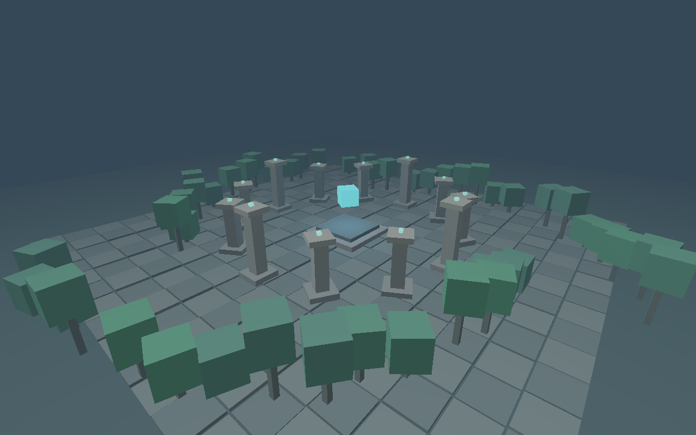

# Swan

Swan is a small C++20 / Vulkan 1.3 3D game engine. Version 0.6 separates the engine runtime, CPU scene/physics code, GPU renderer, and a sample game, **The Quiet Garden**. Walk around a procedural ruined courtyard, collect five golden light shards, and restore its hovering crystal. Scenes can be exported, validated, loaded from JSON, and reloaded while the game runs. Triangle OBJ meshes with UVs and PNG textures are imported as shared CPU assets and rendered using cached Vulkan buffers, images, and descriptors. The default garden is procedural; the OBJ example ships a locally authored crystal.



## Run

Linux with Nix flakes enabled and a Vulkan 1.3 driver is required. The flake provides x86_64-linux and aarch64-linux outputs; development and runtime verification currently use x86_64 Linux.

```sh
nix develop path:.
cmake -S . -B build -G Ninja
cmake --build build
./build/swan
```

The game starts in walking mode. Click to look around, walk toward a golden shard, and press E when the window title says `E collect`. Collect all five to turn the central crystal gold. Progress and interaction hints appear in the window title and console.

```sh
./build/swan --overview
```

`--overview` starts with the original elevated camera in flight mode. GLFW selects the desktop backend automatically; `--x11` forces X11. The automated smoke test uses X11 inside Xvfb, including when launched from a Wayland desktop.

`path:.` includes new files before Git tracking. After tracking all project files, plain `nix develop` works too. `flake.lock` pins nixpkgs. Local build output is excluded from package sources.

To build and run the installed package:

```sh
nix build path:.
./result/bin/swan
```

SPIR-V shaders are installed alongside the executable. Shader lookup uses the installed executable's location, then the CMake build directory. `--shader-dir PATH` overrides it.

## Scene files and material assets

```sh
./build/swan --scene assets/scenes/playground.swan.json
./build/swan --scene assets/scenes/mesh-garden.swan.json
./build/swan --scene assets/scenes/textured-garden.swan.json
./build/swan --export-scene /tmp/garden.swan.json
./build/swan --validate-scene /tmp/garden.swan.json
./build/swan --scene /tmp/garden.swan.json --save-scene /tmp/garden-copy.swan.json
```

Export and validation commands run without initializing GLFW or Vulkan. Edit a loaded scene in your text editor and press F5 to reload it. Failed reloads leave the active game intact. F6 writes the loaded authored definition to the explicit `--save-scene` path; this exports a world, rather than saving player progress or live animation. Successful reload resets progress and respawns at the scene's spawn position.

The versioned JSON format preserves stable entity IDs, transforms, material references, collision/interaction flags, and animation settings. A scene owns a named material asset library; entities share these material definitions. The hand-editable playground demonstrates shared materials and three collectibles. See [the scene format and editing guide](assets/README.md) for field details and validation rules. [See the imported-mesh example](docs/mesh-garden.png) and [the textured example](docs/textured-garden.png).

Version 2 adds named OBJ mesh assets and version 3 adds PNG texture assets, material texture references, and UV tiling. Version 1 and 2 scenes remain readable. Exporters write version 3 and rebase mesh/texture paths relative to the destination scene file. External OBJ and PNG files remain separate assets, so keep them available after exporting.

## Controls

| Input | Action |
| --- | --- |
| Left click / mouse | Capture the mouse / look |
| W / A / S / D | Move horizontally |
| Left Shift | Sprint |
| Space | Jump in walking mode; ascend in flight mode |
| Left Ctrl | Descend in flight mode |
| E | Collect a nearby shard in walking mode |
| F | Switch walking/flight; returning to walking respawns at the entrance |
| P | Pause/resume movement and world animation; mouse look remains active |
| F5 | Reload the input scene; without a file, restart the original world |
| F6 | Export the authored definition to `--save-scene PATH` |
| R | Respawn in walking mode; collected shards remain collected |
| Escape | Release the mouse; press again to quit |

Losing focus releases the mouse and clears held movement. Walking uses gravity, grounded jumping, capsule collision, wall sliding, and automatic respawn after falling out of the world. Flight bypasses collision for inspecting the scene.

## Architecture

| CMake target | Responsibility |
| --- | --- |
| `swan_core` | Scene storage, entity lifetime, material/mesh/texture assets, OBJ/PNG import, JSON persistence, static collision |
| `swan_renderer` | GLFW input/window, Vulkan resources, render snapshots |
| `swan_runtime` | Main loop, fixed simulation updates, render scheduling |
| `swan_demo` | Procedural garden and sample gameplay |
| `swan` | Command-line startup and game/runtime composition |

The core and demo depend on GLM and the core uses nlohmann/json for persistence tinyobjloader for OBJ import, and libpng for PNG decoding, with no GLFW or Vulkan dependency. CPU tests exercise gameplay without creating a window or device.

The engine receives a `GameLayer` from the application. Each display frame samples held input and one-shot actions, applies game actions once, runs simulation updates at **120 Hz**, and renders a `RenderFrame` containing a camera and render objects. Camera position is interpolated between simulation updates. Frame delays are capped at 250 ms and 30 simulation steps to bound catch-up after a stall.

```cpp
swan::Game game(options.overview);
swan::Engine engine(options);
engine.run(game);
```

To implement another game, derive from `GameLayer` and implement `handleInput`, `fixedUpdate`, `renderFrame`, and `status`. Pass your layer to `Engine::run`; the renderer needs no game-specific changes. Link your application to `swan_runtime` and your game code. The default executable links the garden demo separately.

`Scene` owns named entities with stable file keys, transforms, material asset references, optional animation, and solid/collectible flags. Keep `EntityId` handles rather than references across scene mutation. Deletion increments a slot generation; stale handles cannot access a replacement entity. Material names, mesh/texture references, and file keys persist through serialization; runtime handles are recreated on load. Handles belong to their scene; discard them on scene replacement and use stable file keys for references across reloads. Render snapshots contain values, so the GPU layer never owns gameplay entities.

## Rendering and collision

- Vulkan 1.3 dynamic rendering, perspective projection, depth testing, FIFO presentation.
- Per-object yaw, scale, and position; indexed built-in cube and imported triangle meshes.
- Correct inverse-scale normal transformation for nonuniform object scaling.
- Shared immutable CPU meshes and a GPU buffer cache keyed by resource identity; aliases share one upload. Unused buffers are released after the frame fence before recording the next frame.
- Mesh upload currently uses host-visible memory with explicit flushing. Texture pixels use a staging buffer and device-local sRGB images, with layout transitions before sampling.
- Shared linear/repeat sampler, one combined-image-sampler descriptor per cached texture, and white fallback for untextured materials. Texture images/views/descriptors are retired after the frame fence.
- Per-material UV tiling; built-in cube face UVs and imported OBJ UVs, including seams. Textures modulate linear material color and emission.
- Texture upload waits for its queue to finish; asynchronous streaming, anisotropic filtering, and device-local mesh staging are future optimizations.
- Directional sunlight, cyan local lighting, emissive materials, distance fog, and tone mapping.
- Swapchain/depth recreation on resize and waiting while minimized.
- One frame in flight, one frame fence, one acquire semaphore, and a presentation semaphore per swapchain image; shared depth use remains serialized.
- Optional Khronos validation with runtime errors producing a nonzero exit status.
- Upright capsule against static boxes rotated around the vertical axis. Movement is subdivided and contacts iteratively resolved, including floor, ceiling, and wall sliding. Imported meshes use a box proxy derived from their local bounds, transformed by the entity scale and yaw.

This is an early engine foundation. Collision is a character controller, not a general rigid-body simulator; it has no dynamic bodies, arbitrary mesh collision, or automatic stair climbing. OBJ import currently requires triangles and supports positions plus optional normals. Missing normals use flat shading; UVs are retained, with OBJ V coordinates flipped to match PNG rows. Vertex colors, smoothing groups, and OBJ/MTL materials do not affect rendering. PNG base-color textures are supported; alpha is currently ignored and all geometry remains opaque. There is no glTF, skeletal animation, audio, GUI editor, shadow mapping, or bloom yet. The crystal's emission changes its surface color without a bloom pass. These systems can be added on top of the existing scene/game/renderer boundaries.

## Verification

```sh
nix develop path:.
cmake -S . -B build -G Ninja
cmake --build build
ctest --test-dir build --output-on-failure
./build/swan --validation --frames 90 --resize-test
```

For automated rendering without a desktop or hardware GPU:

```sh
nix develop path:. --command bash scripts/smoke-test.sh
```

The smoke test first exports and validates a scene without a window, then uses Xvfb and Mesa Lavapipe, enables synchronization validation, renders 90 frames, and resizes the window twice. It checks walking, overview, exported-scene, hand-authored example, and imported-mesh modes. The mesh and textured cases reload and resize twice to exercise GPU resource replacement, and exports/validates relative mesh paths. The console reports uploads and resident GPU meshes/textures. To test installed shader lookup too:

```sh
nix build path:.
nix develop path:. --command bash scripts/smoke-test.sh ./result/bin/swan
```

CPU tests cover entity deletion/reuse and invalid creation, procedural scene invariants, capsule floor/wall/ceiling contacts and rotated walls, equivalent movement at 60/144 display frames per second, jump/landing, pause, collection/completion, mode switching, and bounded simulation catch-up. Persistence tests cover deterministic round trips, schema/asset errors, invalid-save preservation, authored exports after gameplay, and failed/successful reloads. Mesh tests cover OBJ index validation, supplied/generated normals, vertex sharing, negative indices, degenerate/untriangulated faces, path rebasing, failed reloads, and collision bounds. Texture tests cover PNG decoding, sharing, corrupt-file rejection, material tiling, path persistence, failed/successful reloads, OBJ UV conversion, and UV seams. All three bundled examples have headless command-line validation tests. The tests use explicit checks in release builds.

```sh
nix flake check path:.
./build/swan --help
```

`nix flake check` builds the package and runs five CPU test executables and three headless example validation tests. Graphical smoke tests are separate.

## Layout

| File | Responsibility |
| --- | --- |
| `flake.nix`, `flake.lock` | Pinned toolchain, dependencies, shell, package, checks |
| `src/main.cpp`, `src/options.hpp` | Startup and command-line options |
| `src/engine.*`, `src/fixed_step.hpp` | Runtime orchestration and simulation clock |
| `src/game_layer.hpp`, `src/input.hpp`, `src/render_frame.hpp` | Game/runtime/renderer interfaces |
| `src/scene.*`, `src/camera.hpp` | Entity storage and camera math |
| `src/assets.*`, `src/scene_io.*` | Named material/mesh assets and versioned JSON scene IO |
| `src/mesh.*`, `assets/meshes/` | Indexed cube, triangle OBJ importer, authored crystal model |
| `src/texture.*`, `assets/textures/` | PNG decoder, white fallback, authored courtyard texture |
| `assets/scenes/`, `assets/README.md` | Hand-editable example and scene format guide |
| `src/physics.*` | Character capsule against static boxes |
| `src/game.*`, `src/garden.*` | Sample gameplay and procedural content |
| `src/renderer.*`, `src/renderer_texture.cpp` | GLFW and Vulkan buffers/images/descriptors |
| `shaders/scene.vert`, `shaders/scene.frag` | Geometry, transforms, lighting, fog |
| `tests/`, `scripts/smoke-test.sh` | CPU and graphical verification |

## Driver troubleshooting

`vulkaninfo --summary` should list a working device. On NixOS, enable graphics support in the system configuration; hardware drivers remain a system responsibility. On other Linux distributions, use the host Vulkan driver setup; a NixGL wrapper may be needed. The smoke test selects its own software driver.

## References

[Khronos Vulkan tutorial](https://docs.vulkan.org/tutorial/latest/01_Overview.html), [depth buffering](https://docs.vulkan.org/tutorial/latest/07_Depth_buffering.html), [rendering and presentation](https://docs.vulkan.org/tutorial/latest/03_Drawing_a_triangle/03_Drawing/02_Rendering_and_presentation.html), [vertex input](https://docs.vulkan.org/tutorial/latest/04_Vertex_buffers/00_Vertex_input_description.html), [index buffers](https://docs.vulkan.org/tutorial/latest/04_Vertex_buffers/03_Index_buffer.html), and [tinyobjloader](https://github.com/tinyobjloader/tinyobjloader), [Vulkan texture images](https://docs.vulkan.org/tutorial/latest/06_Texture_mapping/00_Images.html), and [libpng](https://www.libpng.org/pub/png/libpng.html).

## License

Apache-2.0; see [LICENSE](LICENSE).

Textures receive a full CPU-generated mip chain with area filtering in linear RGB, then use trilinear Vulkan sampling. Odd-sized images retain their edge pixels; the 1x1 white fallback stays a single level. This reduces texture shimmer at distance without requiring GPU blit support. See the [Vulkan sampler specification](https://docs.vulkan.org/spec/latest/chapters/samplers.html).
