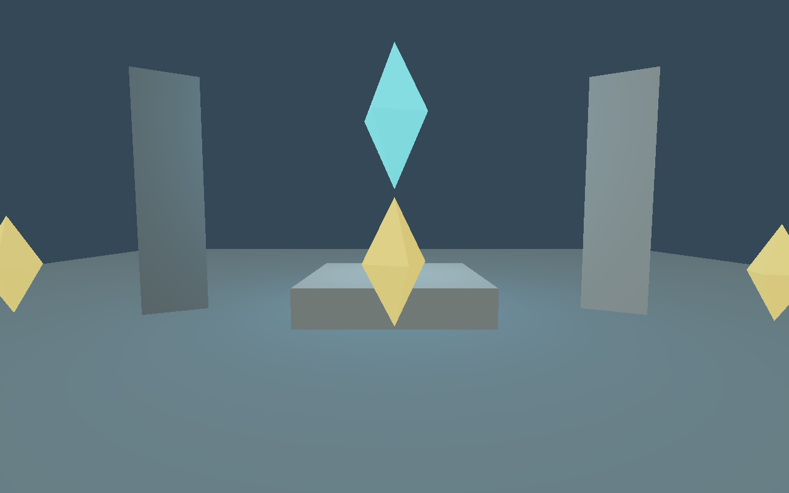
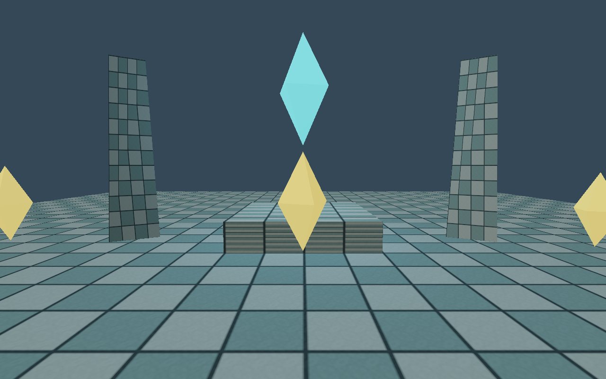

# Swan scene assets

`scenes/playground.swan.json` (version 1) is a small hand-editable world with a floor, two pillars, a crystal goal, and three collectibles. Load it with:

```sh
./build/swan --scene assets/scenes/playground.swan.json
```

A scene file contains `format: "swan-scene"`, integer `version: 1`, `2`, `3`, or `4`, a `spawn` feet position, named `materials`, and `entities`. All vectors use three numeric components. Positions/scales use world units; `yaw` is in radians. Material colors are nonnegative linear RGB values; `emission` is a nonnegative multiplier.

Each entity requires a unique stable `id`, a `name`, a `mesh` asset ID (`builtin:cube` is always available), a named `material`, and a `transform` containing `position`, positive `scale`, and `yaw`. Runtime generation handles are rebuilt when loading; stable file IDs remain unchanged.

Optional flags are `solid`, `collectible`, and `goal`. An optional `animation` contains `base_height`, `phase`, nonnegative `bob`, and `speed`; bobbing uses `sin(time * 1.3 + phase) * bob`, and rotation advances by `speed` radians per second. Animated solid colliders are currently rejected.

The engine scene format allows general worlds. The sample garden game additionally requires exactly one `goal` and at least one `collectible`, and an entity cannot have both flags. Use the `GameLayer` interface for games with different rules.

Materials are shared by stable name. Change one definition to recolor all referencing entities on reload. Version 2 supports imported triangle OBJ meshes; unknown mesh/material IDs, duplicate entity IDs, unknown fields, invalid vectors, unsupported versions, and nonfinite or out-of-range numeric values are rejected. Files are limited to 16 MiB and 10,000 entities.

## Imported meshes

```sh
./build/swan --scene assets/scenes/mesh-garden.swan.json
```



The version 2 example uses the locally authored `meshes/crystal.obj` for the goal and three collectibles. A version 2 scene can declare meshes alongside materials:

```json
"meshes": {
  "crystal-mesh": { "source": "../meshes/crystal.obj" }
}
```

Entities reference `"mesh": "crystal-mesh"`. Source paths are resolved relative to the **scene file's directory**, independently of the working directory. Multiple IDs resolving to the same file share one CPU mesh and one GPU upload. Reload builds a new catalog so file edits become visible; malformed or missing OBJ data prevents the entire world replacement. `builtin:` names cannot be overridden.

The OBJ subset accepts triangular faces, positive/negative position and normal indices, and optional normals. Supplied normals are normalized; missing normals are generated per face for flat shading. Triangulate meshes in your authoring tool before export. Non-triangle faces, line/point primitives, invalid position/normal indices, degenerate triangles, and invalid normals are rejected. Files are limited to 32 MiB and 1,000,000 triangle corners. UVs are retained and the V coordinate is flipped to match PNG row order. Missing UVs default to (0, 0). Vertex colors, smoothing groups, and MTL files are not used; appearance comes from scene materials. Bounds are computed from referenced vertices; solid meshes collide using a rotated box proxy, not exact triangle collision.

Export writes version 4 and rebases mesh/texture sources relative to the output directory. It preserves references rather than copying OBJ/PNG files. Keep referenced files available when moving or sharing a scene. Existing version 1 scenes still load; version 1 does not allow a `meshes` table.

GPU resources use a shared buffer containing vertices and 32-bit indices. Buffers are uploaded once per resource and old ones are freed after the frame fence. `--reload-test --frames 90` triggers F5-style reloads after 10 and 30 frames for validation; use it with `--scene` to exercise mesh replacement.

## PNG textures and UV tiling

```sh
./build/swan --scene assets/scenes/textured-garden.swan.json
```



The version 3 example adds an authored courtyard PNG to the cube floor and an imported tapered-pillar OBJ with UVs. PNG decoding uses libpng; the engine owns the asset catalog and Vulkan upload/rendering code. Add a texture table and reference it from a material:

```json
"textures": {
  "stone-tiles": { "source": "../textures/courtyard.png" }
},
"materials": {
  "floor": {
    "color": [0.7, 0.85, 0.9],
    "emission": 0,
    "texture": "stone-tiles",
    "uv_scale": [8, 8]
  }
}
```

Paths resolve relative to the scene file. Up to 256 imported textures are supported, each limited to 16 MiB encoded and 4096 by 4096 pixels. PNGs decode to RGBA8; the GPU image uses sRGB so sampled RGB enters lighting in linear space. Alpha is decoded but currently ignored by the opaque renderer. JPEG, normal maps, and anisotropic filtering are not implemented yet.

`texture` defaults to `builtin:white` and `uv_scale` defaults to `[1, 1]`. UV scales must be positive and finite. Sampling uses linear filtering and repeat addressing. Each cube face has UVs from 0 to 1; imported meshes use OBJ `vt` coordinates, with V flipped for top-to-bottom PNG storage. Vertex sharing preserves seams where UV indices differ. Missing UVs sample the same point across that face, so author UVs before assigning a detailed texture to an imported model.

Texture aliases share decoded pixels and GPU resources. Reload creates a fresh catalog; invalid PNGs or missing texture references leave the old world active. GPU images, image views, and descriptors are released only after the previous frame completes. Upload uses a temporary staging buffer and an explicit queue wait; resource streaming is currently synchronous. Versions 1 and 2 load without texture fields; version 3 fields are rejected when declared under an older version.

## Editing workflow

Export the full procedural garden without opening a window:

```sh
./build/swan --export-scene /tmp/garden.swan.json
./build/swan --validate-scene /tmp/garden.swan.json
./build/swan --scene /tmp/garden.swan.json --save-scene /tmp/garden-copy.swan.json
```

Edit the input file in your text editor and press F5 in the running game. Successful reload resets gameplay and respawns using the file's `spawn`. If reading, parsing, or game validation fails, the old world stays active; the console reports the cause. Without `--scene`, F5 restarts the original procedural definition.

F6 exports the **loaded authored definition** to the explicit `--save-scene` path. It does not save transient animation, the player's position, removed collectibles, or progress. Use a different output path to keep edits to the input file from being replaced by its currently loaded definition. Save writes a unique temporary file beside the destination and renames it after a complete write; invalid data or write failures do not truncate the destination. This provides atomic replacement on Linux, not guaranteed persistence across power loss.

Scene paths are explicit and relative to the working directory when not absolute. The Nix package also installs these examples under `share/swan/assets/` next to `bin/`.

Mipmaps are generated automatically down to 1x1 in linear RGB, with linear alpha averaging. Vulkan uses trilinear filtering across these levels. No scene schema change or authored mip files are needed.

Scene version 4 adds an optional `"parent": "entity-id"` field to each entity. Transforms and animation heights are local to that parent. Parents may appear later in the file. Missing parents, cycles, nonuniform parent scales, and animated ancestors of solid colliders are rejected. The `hierarchy-garden.swan.json` example groups the collectible shards under a rotating crystal. Export writes version 4 and keeps local transforms and stable parent references.
