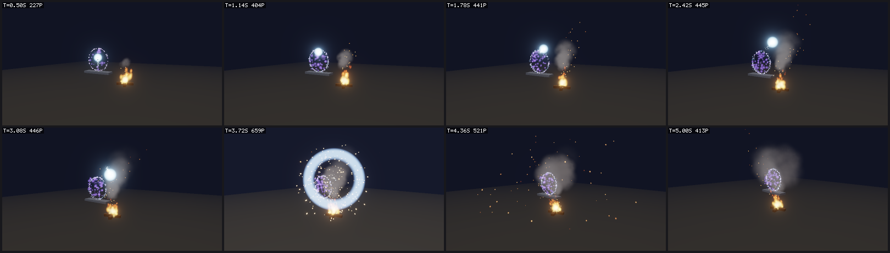

# FX animation guide

Swan authors particle effects and keyframed shots as plain scene data, simulates them
deterministically on the CPU, and renders them with headless Vulkan. The whole loop runs without a
window, so an AI agent (or a CI job) can author an effect, measure it, render it, inspect the
images, and iterate.



`assets/scenes/fx-showcase.swan.json` (generated by `examples/scripts/make-fx-showcase.lua`)
contains a campfire, a portal, and an orb that flies out of the portal and explodes.

## The authoring loop

1. **Author** effects, the timeline, and the environment with the Lua automation API (`swan
   script`) or by editing the scene JSON. Every Lua call is a validated, undoable document command,
   and invalid input names the offending emitter and field.
2. **Measure** with `swan.preview(doc)`: seek to any time and read particle counts, spawn/drop
   totals, and world bounds per emitter. This needs no GPU and returns the same numbers on every
   run.
3. **Look** at a labeled contact sheet (`preview:render_sheet(...)` or `swan render --sheet`).
   Each frame shows its time and live particle count.
4. **Iterate** on what the numbers and images show, then `doc:save(path)`.

```lua
-- swan script my-fx.lua
local doc = swan.new()
doc:set_environment{ background = { 0.01, 0.012, 0.02 }, bloom = 0.8, tonemap = "aces" }
doc:set_effect("sparks", { emitters = { {
  bursts = { { time = 0, count = 150 } }, duration = 0.1, lifetime = { 0.5, 1.2 },
  shape = "sphere", radius = 0.1, radial = true, speed = { 3, 7 }, gravity = { 0, -9, 0 }, drag = 1,
  size = 0.05, sprite = "spark", stretch = 0.1, intensity = 6,
  color_over_life = { { 0, { 1, 0.9, 0.6 } }, { 1, { 1, 0.3, 0.1, 0 } } },
} } })
doc:create{ key = "floor", position = vec3(0, -0.5, 0), scale = vec3(10, 1, 10) }
doc:set_timeline{ duration = 2 }
doc:add_event{ time = 0.2, effect = "sparks", position = vec3(0, 1, 0) }
doc:set_camera{ position = vec3(0, 1.5, 5), target = vec3(0, 0.8, 0), fov = 50 }

local preview = swan.preview(doc)
preview:seek(0.6)
local stats = preview:stats()
print(stats.particles, stats.bounds and stats.bounds.max)
preview:render_sheet("/tmp/sparks.png", { from = 0, to = 1.6, count = 8 })
doc:save("/tmp/sparks.swan.json")
```

```sh
./build/swan script my-fx.lua                    # author, measure, render
./build/swan render /tmp/sparks.swan.json --sheet -o /tmp/sheet.png
./build/swan render /tmp/sparks.swan.json --stats-only --sequence /tmp/x --fps 10   # numbers only, no GPU
./build/swan --scene /tmp/sparks.swan.json --overview   # watch it live (effects loop with the timeline)
```

## Concepts

- **Effect**: a named scene asset (`effects` in the scene file) with 1–16 **emitters**. Effects are
  data; they do nothing until something plays them.
- **Attached effects**: an entity with `"effect": "id"` emits continuously from its world position
  and yaw (scale is ignored). Removing the entity or its effect stops emission; live particles
  finish their lifetime.
- **Timeline**: scene-level keyframe animation. **Tracks** animate entity transforms, attached
  emission (`emit`), material color/emission, and environment exposure/bloom/background.
  **Events** play one-shot effects at a time, at a world position or following an entity. An
  optional **camera** animates the shot. Timelines can loop.
- **Environment**: background/fog color, lighting, exposure, bloom, and tone mapping.
- **Time**: everything advances in fixed 1/120 s ticks. A preview seek replays from the start, so
  results never depend on how you step. `seed` (preview option, `--seed`) varies all particles
  reproducibly.
- **Rendering**: the scene and particles render into an HDR target. A bloom pass and the tone map
  (exposure, Reinhard or ACES) follow. Additive particles add light, so RGB above about 1 (through
  `intensity`) glows. Alpha-blended particles (smoke, dust) composite over the scene and are
  sorted back to front.
- **Runtime state stays separate from authored data**. Timelines, effects, and behaviours only
  modify the runtime copy of a scene; saving writes the authored definition.

## Emitter reference

Times are seconds, angles degrees, and distances world units. A **range** is a number or
`[min, max]`, sampled uniformly per particle. A **curve** is a list of keyframes or a bare
constant. Over-life curves use normalized age 0..1. Unknown fields are rejected.

| Field | Default | Meaning |
| --- | --- | --- |
| `name` | `""` | Label used in errors and statistics. |
| `offset` | `[0,0,0]` | Position relative to the effect origin (rotated by its yaw). |
| `delay` | `0` | Seconds before the emission window starts. |
| `duration` | `1` | Emission window length. |
| `loop` | `false` | Repeat the window, including its rate curve and bursts, forever. |
| `rate` | `0` | Continuous particles per second (0..100000). |
| `rate_over_time` | — | Rate multiplier over the normalized window. |
| `bursts` | `[]` | `[{"time": t, "count": n}]` or `[[t, n]]`; times within `0..duration`. |
| `lifetime` | `1` | Range, 0.001..600 s. |
| `shape` | `"point"` | `point`, `sphere`, `box`, `ring`, `disc`. |
| `radius` | `0.5` | Sphere, ring, and disc radius. |
| `box` | `[1,1,1]` | Box extents. |
| `surface` | `false` | Spawn on the sphere/box surface or disc edge only. |
| `direction` | `[0,1,0]` | Emission axis. Ring and disc shapes lie perpendicular to it, and `orbit` turns around it. |
| `spread` | `0` | Cone half-angle around the direction (0..180; 180 = all directions). |
| `radial` | `false` | Aim each particle outward from the emitter center (explosions); `spread` jitters it. |
| `speed` | `1` | Range of initial speed. |
| `velocity` | `[0,0,0]` | Constant velocity added to every new particle. |
| `gravity` | `[0,0,0]` | Acceleration, for example `[0,-9.8,0]`; positive Y rises like smoke. |
| `drag` | `0` | Exponential velocity damping per second. |
| `noise` | `0` | Smooth turbulent acceleration (flicker, smoke curl). |
| `noise_frequency` | `1` | Spatial frequency of the turbulence. |
| `orbit` | `0` | Radians per second around the emitter axis (vortices, portals). |
| `size` | `0.2` | Range of start size in world units. |
| `size_over_life` | — | Size multiplier over age. |
| `color` | `[1,1,1]` | Linear RGB or RGBA (alpha 0..1). |
| `color_over_life` | — | RGBA multiplier over age; fade alpha to 0 at the end. |
| `intensity` | `1` | HDR RGB multiplier; 2–8 makes additive particles glow through bloom. |
| `rotation` / `spin` | `0` | Ranges: initial angle in degrees, and degrees per second. |
| `stretch` | `0` | Elongate along on-screen velocity (sparks, rain, streaks). Try 0.05–0.4. |
| `blend` | `"additive"` | `additive` (fire, sparks, magic) or `alpha` (smoke, dust, debris). |
| `sprite` | `"soft"` | `soft`, `circle`, `ring` (shockwaves), `square`, `spark` (hot core), `smoke` (noisy puff). |
| `texture` | — | Texture asset ID multiplied with the sprite. |
| `space` | `"world"` | `local`: particles move with the emitter (halos, auras). |
| `max_particles` | `1000` | Live-particle cap (1..20000); refused spawns count as `dropped`. |
| `seed` | `0` | Per-emitter random variation. |

All live effects together are capped at 200000 particles.

## Curves and keyframes

```json
"size_over_life": [[0, 0.5], [0.2, 1, "smooth"], [1, 0]]
"color_over_life": [{"t": 0, "value": [1, 0.8, 0.4]}, {"t": 1, "value": [1, 0.2, 0, 0], "ease": "in"}]
"size_over_life": 2
```

A key is `[time, value]`, `[time, value, ease]`, or `{"t" or "time", "value", "ease"}`. The ease
shapes the segment from that key to the next one: `linear` (default), `step` (hold, then jump),
`smooth` (ease in and out), `in` (accelerate), or `out` (decelerate). The aliases `ease_in`,
`ease_out`, `ease_in_out`, and `hold` are accepted. Times must not decrease, and samples clamp to the
first and last keys.

## Timeline reference

```json
"timeline": {
  "duration": 6, "loop": true,
  "camera": { "position": [[0, [3, 2, 8], "smooth"], [6, [6, 3, 5]]], "target": [0, 1, 0], "fov": 50 },
  "tracks": [
    { "entity": "orb", "property": "position", "keys": [[0, [0, 1, 0], "smooth"], [2, [0, 3, 0]]] },
    { "entity": "orb", "property": "emit", "keys": [[0, 1], [1.9, 1, "step"], [2, 0]] },
    { "material": "orb", "property": "emission", "keys": [[0, 2], [2, 8]] },
    { "environment": true, "property": "exposure", "keys": [[2, 1], [2.05, 1.8, "out"], [2.6, 1]] }
  ],
  "events": [
    { "time": 2, "effect": "explosion", "position": [0, 3, 0] },
    { "time": 0.5, "effect": "puff", "entity": "orb", "offset": [0, 0.2, 0], "seed": 3 }
  ]
}
```

| Target | Properties |
| --- | --- |
| `"entity": key` | `position`, `scale` (vectors, local to the parent), `yaw` (radians), `emit` (attached-effect rate/burst multiplier, 0 stops it) |
| `"material": id` | `color` (vector), `emission` |
| `"environment": true` | `exposure`, `bloom`, `background` (vector) |

- `duration` 0 means "until the last key or event". Without `loop`, the timeline holds its last
  values.
- Events fire once each time the playhead crosses them, so a looping timeline replays them every
  cycle. Event effects removed from the scene are skipped.
- The camera tracks are independent: `position` and `target` (look-at) are vector curves, `fov`
  is in degrees. Without a camera, previews frame the effect sources automatically.
- Deleting an entity through Lua also removes its tracks and events. Deleting an
  effect detaches it and removes its events. Both are undoable.

## Environment reference

```json
"environment": { "background": [0.012, 0.014, 0.025], "fog": 0.002, "ambient": 0.12, "sun": 0.25,
                 "local_light": 0, "exposure": 1.1, "bloom": 0.9, "bloom_threshold": 0.9, "tonemap": "aces" }
```

| Field | Default | Meaning |
| --- | --- | --- |
| `background` | `[0.035, 0.065, 0.095]` | Linear clear color and fog color. |
| `fog` | `0.00065` | Density over squared distance (0 disables). |
| `ambient`, `sun` | `0.24`, `0.9` | Surface lighting. |
| `local_light` | `1` | The garden's cyan light above the origin (0 turns it off). |
| `exposure` | `1` | Brightness before the tone map. |
| `bloom` | `0.35` | Glow strength (0 disables the bloom passes). |
| `bloom_threshold` | `1` | HDR brightness where glow starts (soft knee). |
| `tonemap` | `"reinhard"` | `aces` gives contrastier, more saturated highlights, which suits FX. |

## Lua API summary

Full types are in `lua/types/swan.lua`, which LuaLS uses for completion and checking.

**Document** (`swan.open`, `swan.new`):
`effects()`, `effect(id)`, `set_effect(id, spec)`, `delete_effect(id)`, `timeline()`,
`set_timeline(spec|nil)`, `set_track{entity|material|environment, property, keys}` (no keys
removes it), `add_event{time, effect, entity?, position?, yaw?, seed?}`, `set_camera{position,
target, fov}`, `environment()`, `set_environment{...}` (merges). Entities accept `effect` in
`create{}` and `set(key, { effect = "id" | false })`.

**Preview** (`swan.preview(doc_or_path, { seed, scripts })`): `step(s)`, `seek(t)`, `restart()`,
`stats()`, `particles(limit)`, `entity(key)`, `entities()`, `material(id)`, `camera()`,
`play(effect, opts)`, `messages()`, `render(path, opts)`, and `render_sheet(path, { from, to, count,
columns, width, height, supersample, labels, camera })`. Its fields are `time`, `ticks`,
`duration`, `timeline_time`, `particle_count`, and `can_render`. Rendering works inside `swan script`
(set `SWAN_VALIDATION=1` to enable Vulkan validation); other hosts get a clear error.

**Behaviour scripts** (sandboxed, per entity): `game.effect(id, { position, entity, yaw, seed })`
plays a one-shot effect, and `self.entity.effect = "id"` or `nil` swaps or stops an attached
effect. `game.spawn{ ..., effect = "id" }` also works.

## Command line

```
swan render SCENE [OPTIONS]
  -o, --output PATH       Output PNG (default render.png, or sheet.png with --sheet)
  --time T                One frame at T seconds (default: half the timeline)
  --sheet                 Labeled contact sheet; --from/--to/--count/--columns
  --sequence DIR          DIR/frame_0000.png ... at --fps (default 24), e.g. for ffmpeg
  --size WxH              Frame size (640x360; 320x180 per sheet frame)
  --supersample N         1..4 (default 2)
  --camera X,Y,Z,TX,TY,TZ[,FOV]
  --seed N  --no-scripts  --validation
  --stats                 One JSON line per rendered time (particles, bounds, per emitter)
  --stats-only            Statistics without rendering; no GPU needed
```

To turn a sequence into a video: `ffmpeg -framerate 24 -i DIR/frame_%04d.png -pix_fmt yuv420p out.mp4`.

## Recipes

These are starting points; tune `rate`, `size`, and `intensity` against a contact sheet.

- **Fire**: `disc` radius 0.3, `rate` 50–70, `lifetime` [0.5, 0.9], `speed` [1, 1.7], `spread` 8,
  `size` [0.2, 0.4], `stretch` 0.3, `noise` 1.4. Use `color_over_life` from yellow (alpha 0) to
  orange to dark red (alpha 0), with `intensity` about 1.6.
- **Embers**: `sprite` `spark`, `size` 0.05, `stretch` 0.1, `intensity` 6–8, `noise` 2.5,
  `drag` 0.5, upward `speed` [1.8, 3.2].
- **Smoke**: `blend` `alpha`, `sprite` `smoke`, dark gray `color`, `size_over_life` 0.6→2.6, alpha
  0→0.5→0, `spin` ±30, slow upward `speed`, low `noise`.
- **Explosion**: in one effect, `bursts` at time 0: a single big `flash` (lifetime 0.2, size 2–3,
  high intensity, `size_over_life` growing with `out`); radial `sparks` (`sphere`, `radial`,
  `speed` 4–9, `gravity`, `drag`, `stretch`); a `ring`-sprite shockwave growing to 5–6x; and
  alpha-blended smoke. Add an exposure kick on the timeline.
- **Portal or vortex**: a `ring` shape with `direction` facing the camera axis, `orbit` 2–3, and
  `spread` 180 with tiny speed. Add an inner `disc` with the opposite orbit and a soft purple color.
- **Trail**: attach a looping `sphere` emitter to a moving entity. World-space particles stay
  behind, and sub-tick spawn interpolation keeps fast trails continuous.
- **Aura or halo**: `space` `local`, `speed` 0, short lifetime, large soft sprite.
- **Rain**: a `box` shape high above, `velocity` [0, -12, 0], `stretch` 0.15, `size` 0.02, and
  pale blue `alpha` or low-intensity additive.

## Art-direction tips

- Dark backgrounds, `tonemap` `aces`, and `bloom` 0.6–1 make additive effects read. On bright
  scenes, use alpha-blended particles.
- Many large overlapping additive particles turn into a white blob. Lower `rate`, `size`, or
  `intensity` before raising bloom.
- Fade alpha in and out with `color_over_life` (start and end at 0) to avoid popping.
- Check bounds in `stats()` to confirm that effects stay in frame, and read `dropped` to see
  whether `max_particles` is clipping an effect.

## Limits

Particles are camera-facing billboards with no lighting, shadows, collisions, soft
depth-intersection fade, or GPU simulation. Entity scale does not scale effects. The timeline
animates yaw only (no pitch or roll), mirroring the scene's transform model. Bloom and tone mapping
apply to the whole frame.
